# Итоговая аттестация #

**1.Используя команду cat в терминале операционной системы Linux, создать два файла 
Домашние животные(заполнив файл собаками, кошками, хомяками) и 
Вьючные животными заполнив файл Лошадьми, верблюдамии ослы),а затем 
объединить их.
Просмотреть содержимое созданного файла. Переименовать файл,дав ему 
новое имя (Друзья человека).** 

**2.Создать директорию, переместить файл туда.**

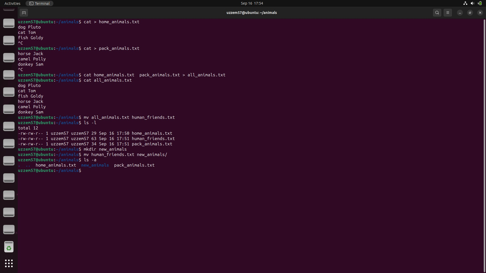

**3.Подключить дополнительный репозиторий MySQL.
Установить любой пакет из этого репозитория.** 

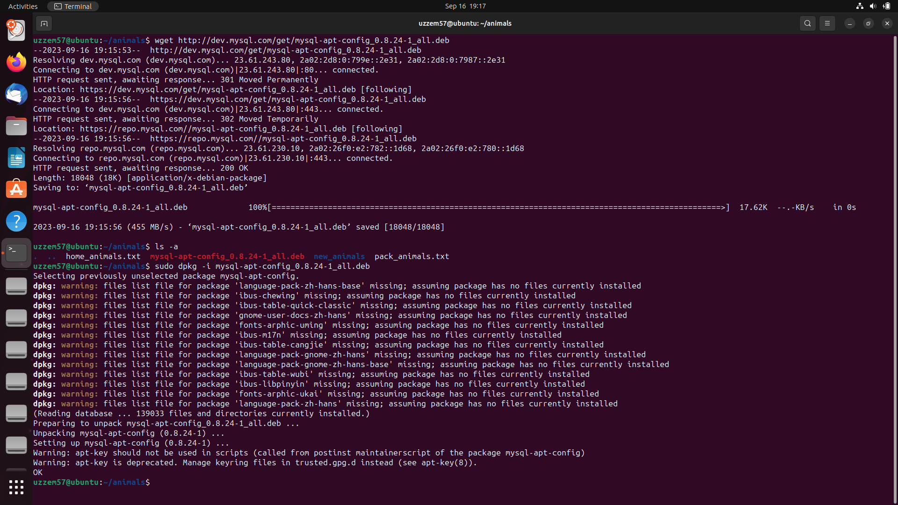

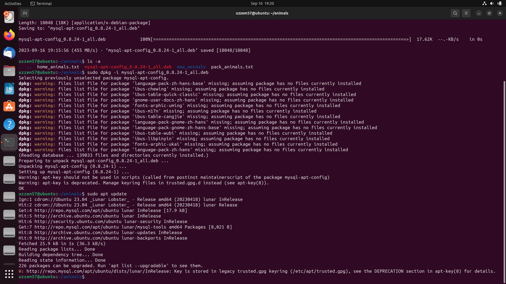

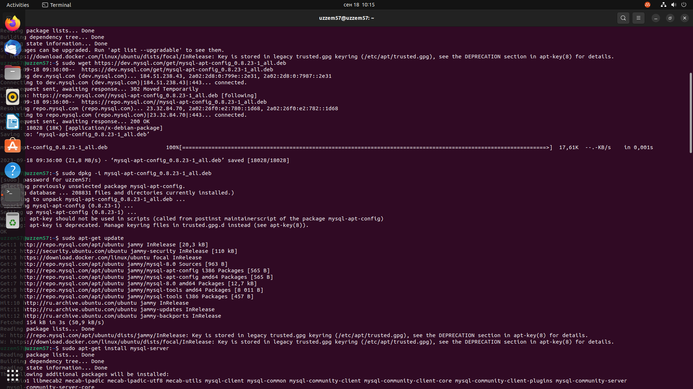

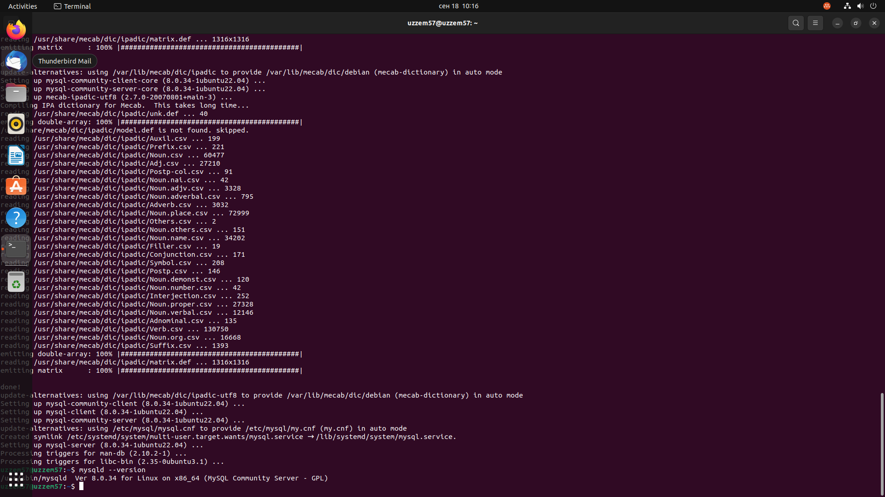

**4.Установить и удалить deb-пакет с помощью dpkg.**

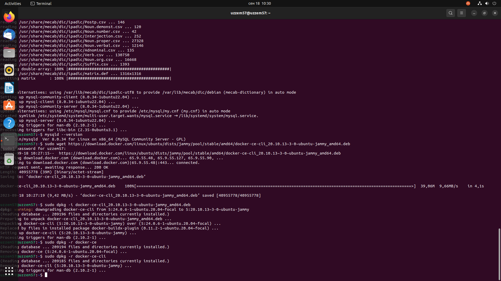

**5.Выложить историю команд в терминале ubuntu**

#### Task 1 ####
mkdir animals\
cd ~/animals\
cat > home_animals.txt\
cat > pack_animals.txt\
cat home_animals.txt pack_animals.txt > all_animals.txt\
cat all_animals.txt\
mv all_animals human_friends.txt\
ls -l\

#### Task 2 ####
cd ..\
mkdir new_animals\
cd ~/new_animals\
mv human_animals.txt new_animals\
cd ~/new_animals\
ls -a\

#### Task 3 ####
sudo wget https://dev.mysql.com/get/mysql-apt-config_0.8.23-1_all.deb\
sudo dpkg -i mysql-apt-config_0.8.23-1_all.deb\
sudo apt-get update\
sudo apt-get install mysql-server\

#### Task 4 ####
sudo wget https://download.docker.com/linux/ubuntu/dists/jammy/pool/stable/amd64/docker-ce-cli_20.10.13~3-0~ubuntu-jammy_amd64.deb\
sudo dpkg -i docker-ce-cli_20.10.133-0ubuntu-jammy_amd64.deb\
sudo dpkg -r docker-ce-cli\

**6.Нарисовать диаграмму,в которой есть класс родительский класс,домашние животные и вьючные животные,в составы 
которых в случае домашних животных войдут классы: собаки, кошки, хомяки, а в класс вьючные животные войдут:
Лошади,верблюды и ослы).**

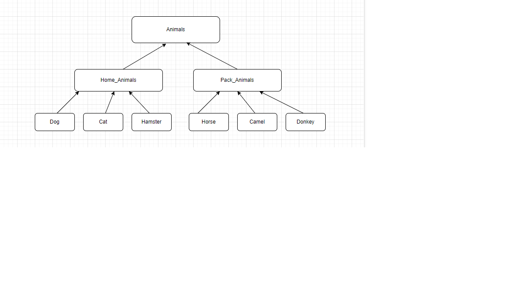

**7.В подключенном MySQL репозитории создать базу данных “Друзья
   человека”**

CREATE DATABASE Human_friends;

**8.Создать таблицы с иерархией из диаграммы в БД**

USE Human_friends;\
CREATE TABLE animal_classes\
(\
Id INT AUTO_INCREMENT PRIMARY KEY,\
Class_name VARCHAR(20)\
);

INSERT INTO animal_classes (Class_name)\
VALUES ('вьючные'),\
('домашние');

CREATE TABLE packed_animals\
(\
Id INT AUTO_INCREMENT PRIMARY KEY,\
Genus_name VARCHAR (20),\
Class_id INT,\
FOREIGN KEY (Class_id) REFERENCES animal_classes (Id) ON DELETE CASCADE ON UPDATE CASCADE\
);

INSERT INTO packed_animals (Genus_name, Class_id)\
VALUES ('Лошади', 1),\
('Ослы', 1),  \
('Верблюды', 1);

CREATE TABLE home_animals\
(\
Id INT AUTO_INCREMENT PRIMARY KEY,\
Genus_name VARCHAR (20),\
Class_id INT,\
FOREIGN KEY (Class_id) REFERENCES animal_classes (Id) ON DELETE CASCADE ON UPDATE CASCADE\
);

INSERT INTO home_animals (Genus_name, Class_id)\
VALUES ('Кошки', 2),\
('Собаки', 2),  \
('Хомяки', 2);

CREATE TABLE cats\
(       \
Id INT AUTO_INCREMENT PRIMARY KEY,\
Name VARCHAR(20),\
Birthday DATE,\
Commands VARCHAR(50),\
Genus_id int,\
Foreign KEY (Genus_id) REFERENCES home_animals (Id) ON DELETE CASCADE ON UPDATE CASCADE\
);

**9.Заполнить низкоуровневые таблицы именами(животных), командами
которые они выполняют и датами рождения**

INSERT INTO cats (Name, Birthday, Commands, Genus_id)\
VALUES ('Мурзик', '2021-01-01', 'кс-кс-кс', 1),\
('Васька', '2022-01-01', "фу!", 1),  
('Ваучер', '2023-01-01', "", 1);

CREATE TABLE dogs\
(       
Id INT AUTO_INCREMENT PRIMARY KEY,\
Name VARCHAR(20),\
Birthday DATE,\
Commands VARCHAR(50),\
Genus_id int,\
Foreign KEY (Genus_id) REFERENCES home_animals (Id) ON DELETE CASCADE ON UPDATE CASCADE\
);\
INSERT INTO dogs (Name, Birthday, Commands, Genus_id)\
VALUES ('Шарик', '2020-01-01', 'ко мне, голос', 2),\
('Тузик', '2022-06-12', "сидеть, лапу", 2),  \
('Плуто', '2018-02-01', "сидеть,  фас", 2),\
('Чубайс', '2016-03-10', "сидеть,  место", 2);

CREATE TABLE hamsters\
(       
Id INT AUTO_INCREMENT PRIMARY KEY,\
Name VARCHAR(20),\
Birthday DATE,\
Commands VARCHAR(50),\
Genus_id int,\
Foreign KEY (Genus_id) REFERENCES home_animals (Id) ON DELETE CASCADE ON UPDATE CASCADE\
);\
INSERT INTO hamsters (Name, Birthday, Commands, Genus_id)\
VALUES ('Хомяк1', '2023-12-11', NULL, 3),\
('Хомяк2', '2023-01-11', NULL, 3),\  
('Хомяк3', '2023-03-10', NULL, 3),\
('Хомяк4', '2023-05-10', NULL, 3);

CREATE TABLE horses\
(      
Id INT AUTO_INCREMENT PRIMARY KEY,\
Name VARCHAR(20),\
Birthday DATE,\
Commands VARCHAR(50),\
Genus_id int,\
Foreign KEY (Genus_id) REFERENCES packed_animals (Id) ON DELETE CASCADE ON UPDATE CASCADE\
);\
INSERT INTO horses (Name, Birthday, Commands, Genus_id)\
VALUES ('Лошадь1', '2015-01-12', NULL, 1),\
('Лошадь', '2017-03-12', "рысью", 1),\
('Лошадь3', '2016-07-12', "бегом ", 1),\
('Лошадь4', '2028-11-10', "шагом", 1);

CREATE TABLE donkeys
(\       
Id INT AUTO_INCREMENT PRIMARY KEY,\
Name VARCHAR(20),\
Birthday DATE,\
Commands VARCHAR(50),\
Genus_id int,\
Foreign KEY (Genus_id) REFERENCES packed_animals (Id) ON DELETE CASCADE ON UPDATE CASCADE\
);\
INSERT INTO donkeys (Name, Birthday, Commands, Genus_id)\
VALUES ('Осел1', '2020-05-10', NULL, 2),\
('Осел2', '2019-06-12', "", 2), \
('Осел3', '2017-08-12', "", 2),\
('Осел4', '2018-10-10', NULL, 2);\

CREATE TABLE camels
(\       
Id INT AUTO_INCREMENT PRIMARY KEY,\
Name VARCHAR(20),\
Birthday DATE,\
Commands VARCHAR(50),\
Genus_id int,\
Foreign KEY (Genus_id) REFERENCES packed_animals (Id) ON DELETE CASCADE ON UPDATE CASCADE
);\
INSERT INTO camels (Name, Birthday, Commands, Genus_id)\
VALUES ('Верблюд1', '2022-04-10', NULL, 3),\
('Верблюд2', '2019-03-12', NULL, 3), \ 
('Верблюд3', '2015-07-12', NULL, 3),\
('Верблюд4', '2022-12-10', NULL, 3);

**10. Удалив из таблицы верблюдов, т.к. верблюдов решили перевезти в другой
    питомник на зимовку. Объединить таблицы лошади, и ослы в одну таблицу.**

SET SQL_SAFE_UPDATES = 0;\
DELETE FROM camels;

SELECT Name, Birthday, Commands FROM horses\
UNION SELECT  Name, Birthday, Commands FROM donkeys;

**11.Создать новую таблицу “молодые животные” в которую попадут все
животные старше 1 года, но младше 3 лет и в отдельном столбце с точностью
до месяца подсчитать возраст животных в новой таблице**

CREATE TEMPORARY TABLE animals AS\
SELECT *, 'Лошади' as genus FROM horses\
UNION SELECT *, 'Ослы' AS genus FROM donkeys\
UNION SELECT *, 'Собаки' AS genus FROM dogs\
UNION SELECT *, 'Кошки' AS genus FROM cats\
UNION SELECT *, 'Хомяки' AS genus FROM hamsters;

CREATE TABLE yang_animal AS\
SELECT Name, Birthday, Commands, genus, TIMESTAMPDIFF(MONTH, Birthday, CURDATE()) AS Age_in_month\
FROM animals WHERE Birthday BETWEEN ADDDATE(curdate(), INTERVAL -3 YEAR) AND ADDDATE(CURDATE(), INTERVAL -1 YEAR);

SELECT * FROM yang_animal;

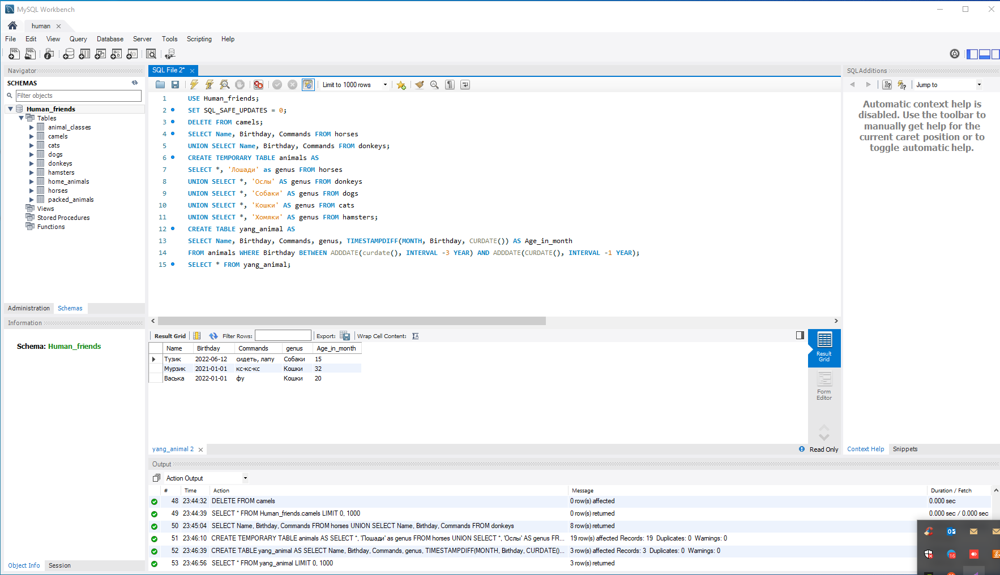

**12. Объединить все таблицы в одну, при этом сохраняя поля, указывающие на
прошлую принадлежность к старым таблицам.**

SELECT h.Name, h.Birthday, h.Commands, pa.Genus_name, ya.Age_in_month\
FROM horses h\
LEFT JOIN yang_animal ya ON ya.Name = h.Name\
LEFT JOIN packed_animals pa ON pa.Id = h.Genus_id\
UNION\
SELECT d.Name, d.Birthday, d.Commands, pa.Genus_name, ya.Age_in_month\
FROM donkeys d\
LEFT JOIN yang_animal ya ON ya.Name = d.Name\
LEFT JOIN packed_animals pa ON pa.Id = d.Genus_id\
UNION\
SELECT c.Name, c.Birthday, c.Commands, ha.Genus_name, ya.Age_in_month\
FROM cats c\
LEFT JOIN yang_animal ya ON ya.Name = c.Name\
LEFT JOIN home_animals ha ON ha.Id = c.Genus_id\
UNION\
SELECT d.Name, d.Birthday, d.Commands, ha.Genus_name, ya.Age_in_month\
FROM dogs d\
LEFT JOIN yang_animal ya ON ya.Name = d.Name\
LEFT JOIN home_animals ha ON ha.Id = d.Genus_id\
UNION\
SELECT hm.Name, hm.Birthday, hm.Commands, ha.Genus_name, ya.Age_in_month\
FROM hamsters hm\
LEFT JOIN yang_animal ya ON ya.Name = hm.Name\
LEFT JOIN home_animals ha ON ha.Id = hm.Genus_id;

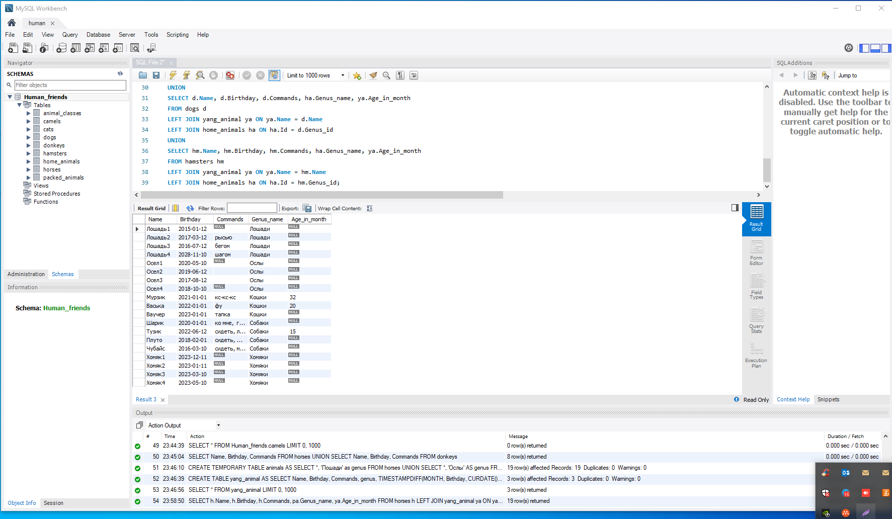

**13.Создать класс с Инкапсуляцией методов и наследованием по диаграмме.**

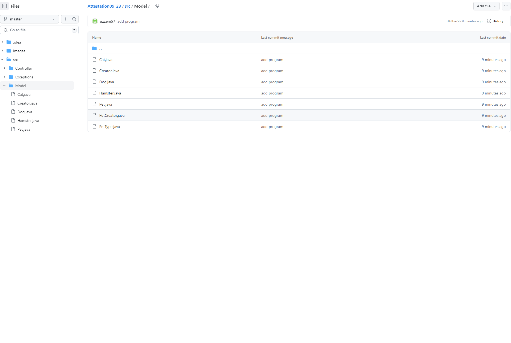

**14. Написать программу, имитирующую работу реестра домашних животных.\
    В программе должен быть реализован следующий функционал:\
    14.1 Завести новое животное\
    14.2 определять животное в правильный класс\
    14.3 увидеть список команд, которое выполняет животное\
    14.4 обучить животное новым командам\
    14.5 Реализовать навигацию по меню**

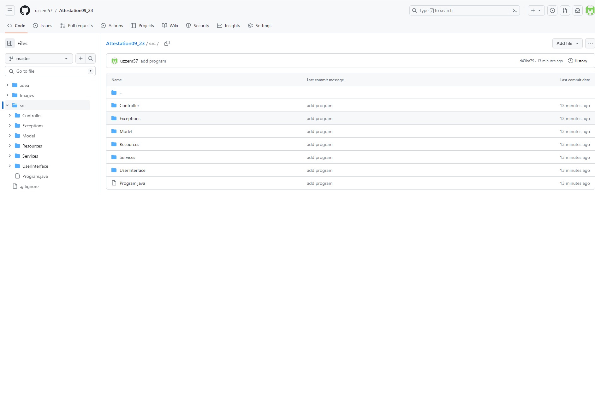

**15.Создайте класс Счетчик, у которого есть метод add(), увеличивающий̆
значение внутренней̆int переменной̆на 1 при нажатие “Завести новое
животное” Сделайте так, чтобы с объектом такого типа можно было работать в
блоке try-with-resources. Нужно бросить исключение, если работа с объектом
типа счетчик была не в ресурсном try и/или ресурс остался открыт. Значение
считать в ресурсе try, если при заведения животного заполнены все поля.**

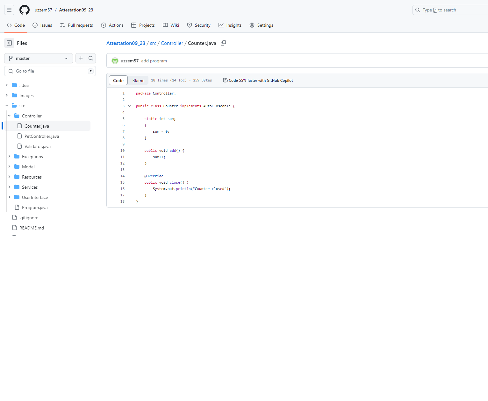

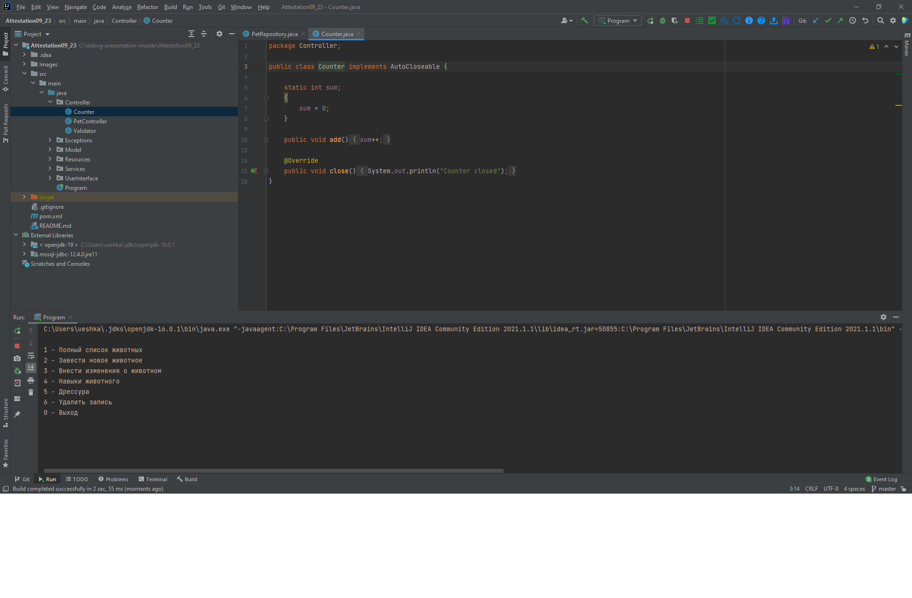